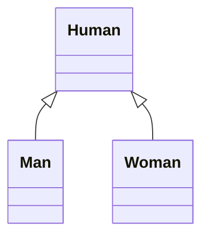
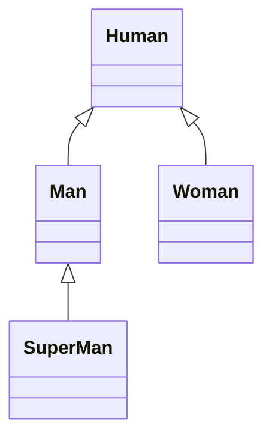

### 类的继承

如果 A 和 B 都是类，并且可以描述为A 是 B，则A 和 B 形成继承关系：

+ B是父类，A是子类
+ B派生A，A继承自B
+ B是A的基类，A是B的派生类


如果 A 继承自 B，则 A 中自动拥有B中的所有成员。




如图所示， Man 和 Woman 都继承自 Human

```ts
class Human {
    name: string = "";
    age: number = 0;

    sayHello(): void {
        console.log('aaoo!');
    }
}


class Man extends Human {
    name: string = "Tom"; // override 类型匹配，不能修改成其他类型。
    age: number = 1;  // override

    sayHello(): void { // override
        console.log("hello i am a man");
    }
}

class Woman extends Human {
    name: string = "Alisa";
    age: number = 1;

    sayHello(): void {
        console.log("hey i am a woman!");
    }
}


// 鸭子辨形法， 虽然是 Human 的类型，但是我们的实例是 Man。
let m: Human = new Man()
m.sayHello()
```

### 成员的重写

重写（override）：子类中覆盖父类的成员

子类成员不能改变父类成员的类型

无论是属性还是方法，子类都可以对父类的响应成员进行重写，但是重写时，需要保证类型的匹配。

注意 this 关键字：在继承关系中，this 的指向是动态的，调用方法时，根据具体的调用者确定 this 指向。

super 关键字：在子类的方法中，可以使用 super 关键字读取父类成员。


### 类型匹配

鸭子辨形法

子类的对象，始终可以赋值给父类

面相对象中，这种现象，叫做里氏替换原则

如果需要判断一个数据的具体子类类型，可以使用 instanceof


### protected 修饰符

readonly：只读修饰符

访问权限修饰符：

private ，public ，protected

protected：受保护的成员，只能在自身和子类中访问。


### 单根性和传递性

单根性：每个类最多只能拥有一个父类

传递性：如果 A 是 B 的父类，B 是 C 的父类，则可以认为 A也是 C 的父类。



